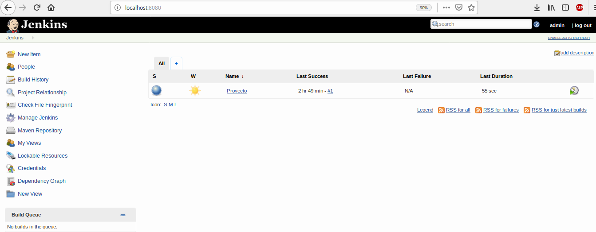
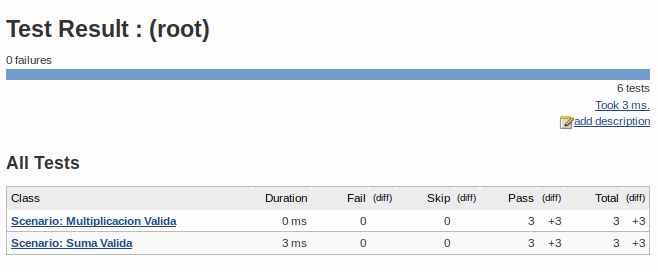
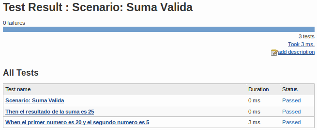

# AutomatizacionDesarrolloSoftware
Linea de automatización de desarrollo de software

Repositorio relacionado con el uso de JUnit, Cucumber y Jenkins para el desarrollo de una calculadora en JAVA

## Integrantes:

Jaime Santana Santana - 20132020212

Oscar Hernandez Cepeda - 20152020019

Juan Sanchez Mancilla - 20152020020

--------------------------------------------------------------------------------------------------------------------

# JUNIT

JUnit es un conjunto de clases (framework) que permite realizar la ejecución de clases Java de manera controlada, 
para poder evaluar si el funcionamiento de cada uno de los métodos de la clase se comporta como se espera. 

Es decir, en función de algún valor de entrada se evalúa el valor de retorno esperado; 
si la clase cumple con la especificación, entonces JUnit devolverá que el método de la clase pasó exitosamente la prueba; 
en caso de que el valor esperado sea diferente al que regresó el método durante la ejecución, 
JUnit devolverá un fallo en el método correspondiente.

--------------------------------------------------------------------------------------------------------------------

# CUCUMBER

Cucumber es un marco de prueba que soporta Behavior Driven Development (BDD), 
que permite a los usuarios definir las operaciones de la aplicación en texto sin formato. 

Funciona según el lenguaje específico de dominio (DSL) de Gherkin. 
Esta sintaxis simple pero poderosa de Gherkin permite a los desarrolladores y evaluadores escribir pruebas complejas, 
al mismo tiempo que es comprensible incluso para los usuarios no técnicos.

--------------------------------------------------------------------------------------------------------------------

# JENKINS

Jenkins es un servidor de automatización para desarrollar de software mediante integración continua y facilita ciertos aspectos de la entrega continua. 
Admite herramientas de control de versiones como CVS, Subversion, Git, Mercurial, Perforce y Clearcase y puede ejecutar proyectos basados en Apache Ant y Apache Maven, así como secuencias de comandos de consola y programas por lotes de Windows
que permite a los usuarios definir las operaciones de la aplicación en texto sin formato. 

----------------------------------------------------------------------------------------------------------

# Entorno Docker

Para el uso y prueba del sistema se utiliza el entorno docker, por el cual se descarga una imagen y se almacena en un contenedor para su uso posterior, en este caso se procede asi:

Ejecucion de comandos:

### Pull de la imagen en docker
docker pull ataches/pruebas_software:latest

### Imagen temporal
docker run --name temporal ataches/pruebas_software /bin/true

### Copiar data al temporal  
docker cp temporal:/backup_pruebas.tar backup_pruebas.tar

### Borrar repositorio temporal 
docker rm temporal

### Crear volumen
docker volume create --name jenkins_data

### Hacer restore del backup
cat backup_pruebas.tar | docker run -i -v jenkins_data:/volume --rm loomchild/volume-backup restore -

### Ejecutar jenkins utilizando los datos de jenkins_data
docker run --name jenkinsgestion -d -v jenkins_data:/var/jenkins_home -p 8080:8080 -p 50000:50000 ataches/pruebas_software:latest

### Ejecución del entorno
localhost:8080

user: admin pass: admin

 
 
 

